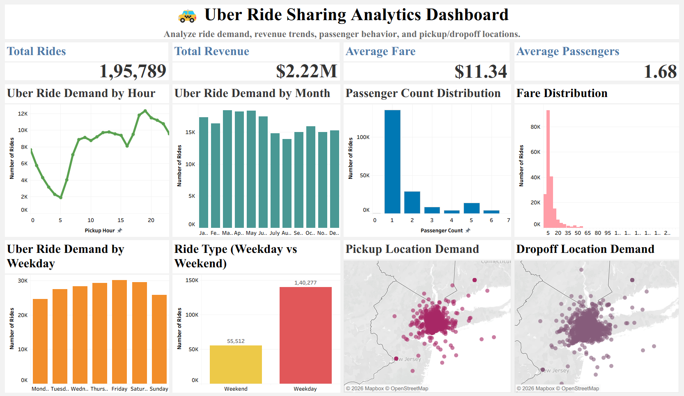
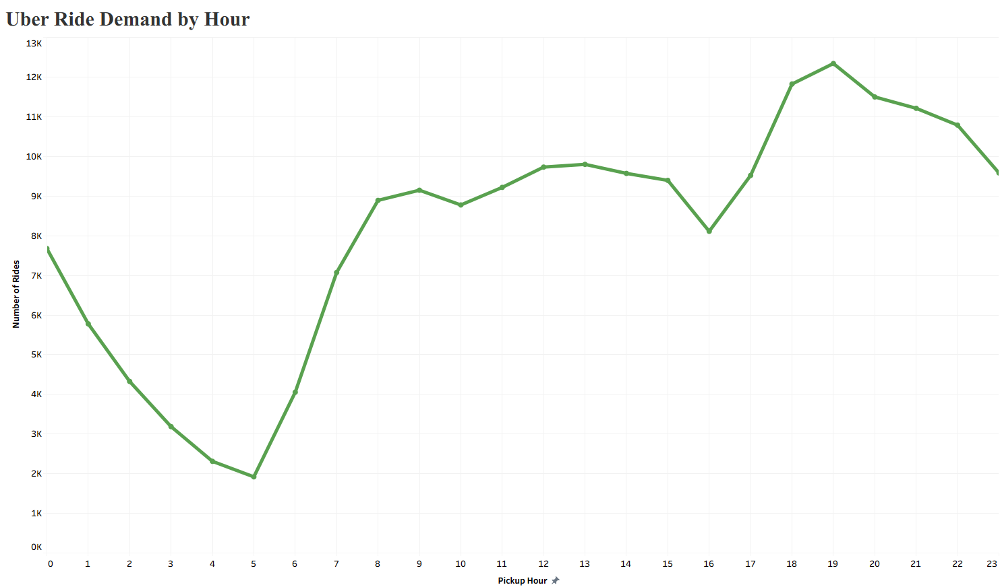
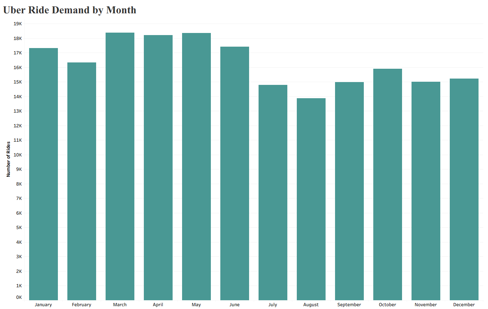
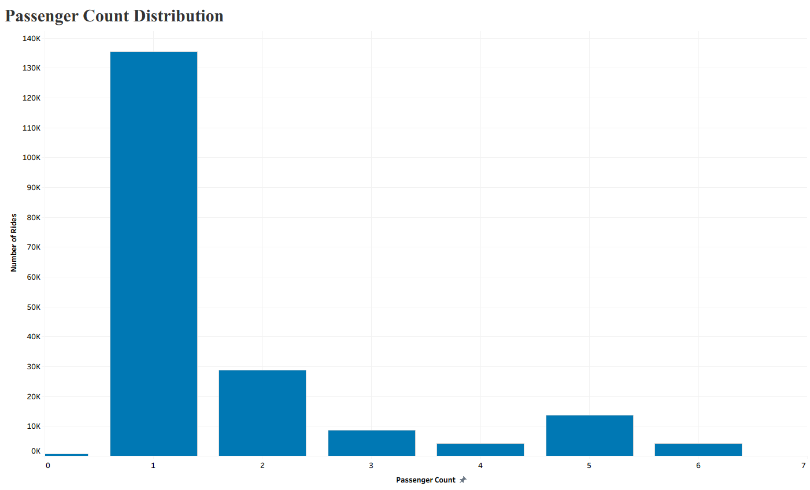
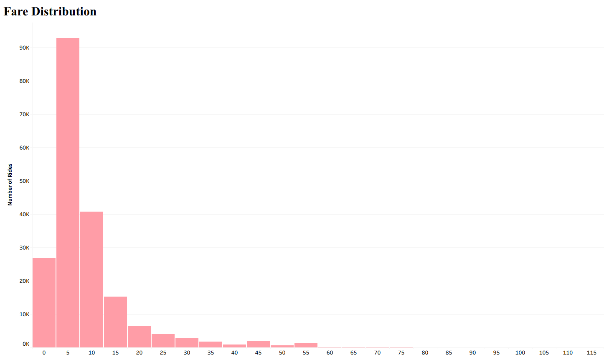
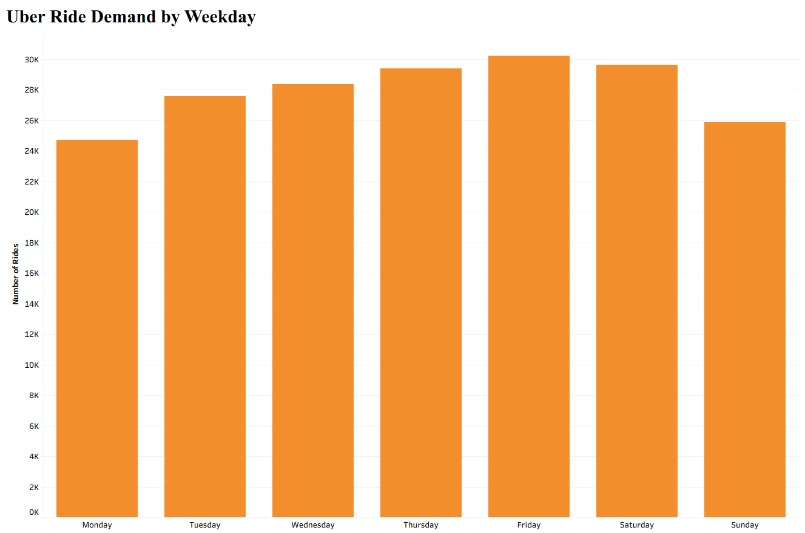
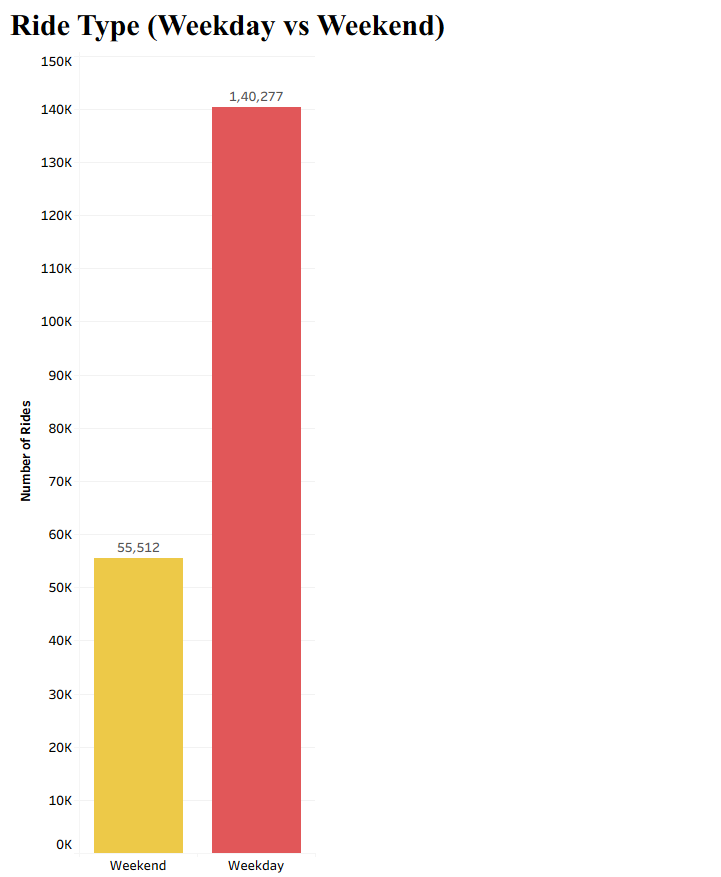
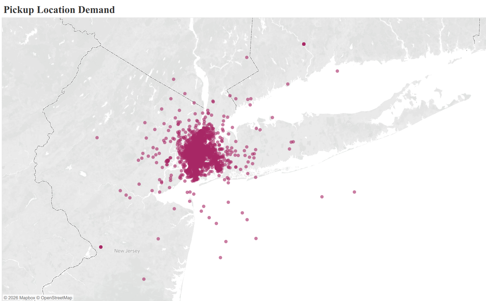
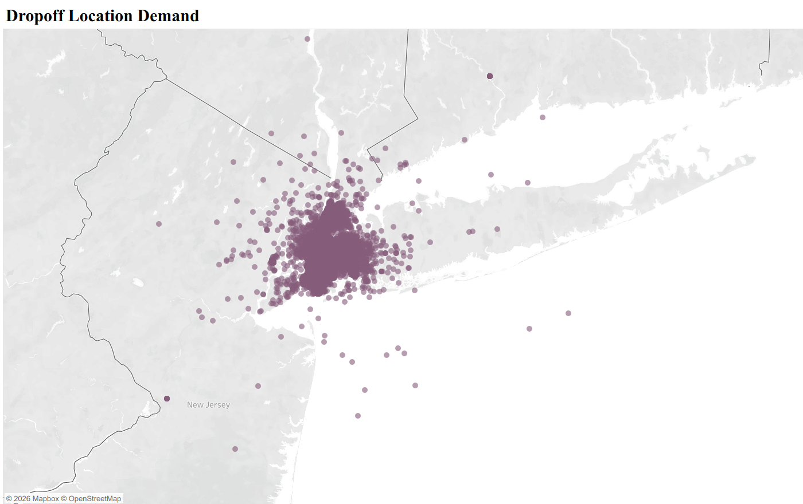

&nbsp;&nbsp;&nbsp;&nbsp;&nbsp;&nbsp;&nbsp;&nbsp;
&nbsp;&nbsp;&nbsp;&nbsp;&nbsp;&nbsp;&nbsp;&nbsp;
&nbsp;&nbsp;&nbsp;&nbsp;&nbsp;&nbsp;&nbsp;&nbsp;
&nbsp;&nbsp;&nbsp;&nbsp;&nbsp;&nbsp;&nbsp;&nbsp;
&nbsp;&nbsp;&nbsp;&nbsp;&nbsp;&nbsp;&nbsp;&nbsp;

# 🚕 Uber Ride Sharing Analytics Dashboard

End-to-end Uber ride-sharing analytics project using **Python, SQL, and Tableau** to analyze ride demand, revenue trends, passenger behavior, and pickup/dropoff patterns. The project follows a complete data analytics workflow—from raw data cleaning to interactive dashboard creation and SQL-based business analysis.

## Tableau Dashboard

🔗 **Live Dashboard:** [Visit My Dashboard↗](https://public.tableau.com/app/profile/bushra.shaikh/viz/UberRideSharingAnalyticsDashboard/Dashboard1)

## 📌 Project Overview

This project analyzes Uber ride-sharing data to uncover valuable business insights that can help improve operational efficiency and customer experience.

The workflow includes:

* Data Cleaning using Python
* Feature Engineering
* Exploratory Data Analysis (EDA)
* Interactive Tableau Dashboard
* SQL Business Analysis
* Business Insights

## 🎯 Project Objectives

* Analyze ride demand across different hours, weekdays, and months.
* Study revenue trends.
* Understand passenger behavior.
* Identify busiest pickup and dropoff locations.
* Build an interactive business dashboard.
* Perform SQL-based business analysis.

## 📊 Dataset Information

The dataset contains approximately **195,000 Uber rides** with information such as:

* Fare Amount
* Pickup Date & Time
* Pickup Coordinates
* Dropoff Coordinates
* Passenger Count

Additional features were engineered during preprocessing, including:

* Pickup Hour
* Pickup Day
* Pickup Month
* Pickup Year
* Weekday Name
* Month Name
* Day Type (Weekday / Weekend)

## 🛠️ Technologies Used

* Python
* Pandas
* NumPy
* Matplotlib
* Seaborn
* MySQL
* Tableau Public
* Jupyter Notebook
* Git & GitHub

## Dashboard Overview

## 📊 Dashboard Visualizations

### Total Rides

### Ride Demand by Month

### Passenger Count Distribution

### Fare Distribution

### Ride Demand by Weekday

### Ride Type (Weekday vs Weekend)

### Pickup Location Demand

### Dropoff Location Demand

## 🗄️ SQL Analysis

SQL was used to perform business analysis on the processed dataset.

The analysis includes:

* Basic KPIs
* Hourly Ride Analysis
* Weekday Analysis
* Monthly Analysis
* Passenger Analysis
* Pickup & Dropoff Location Analysis
* Business Insights Queries

## 💡 Key Business Insights

* Weekdays generate significantly more rides than weekends.
* Most rides occur during evening peak hours.
* May recorded the highest ride demand.
* Average fare is approximately **$11.34**.
* Most rides involve a single passenger.
* Pickup demand is concentrated in a few high-density locations.

## ▶️ How to Run This Project

1. Clone this repository.
2. Open the notebooks in Jupyter Notebook.
3. Run the notebooks in sequence.
4. Import the processed dataset into MySQL.
5. Execute the SQL queries.
6. Open the Tableau workbook or view the published dashboard.

## 🚀 Future Improvements

* Predict ride demand using Machine Learning.
* Fare prediction model.
* Driver demand forecasting.
* Time-series demand analysis.
* Interactive dashboard filters.

## 👩‍💻 Author

**Bushra Shaikh**

B.Tech Computer Science (Data Science)